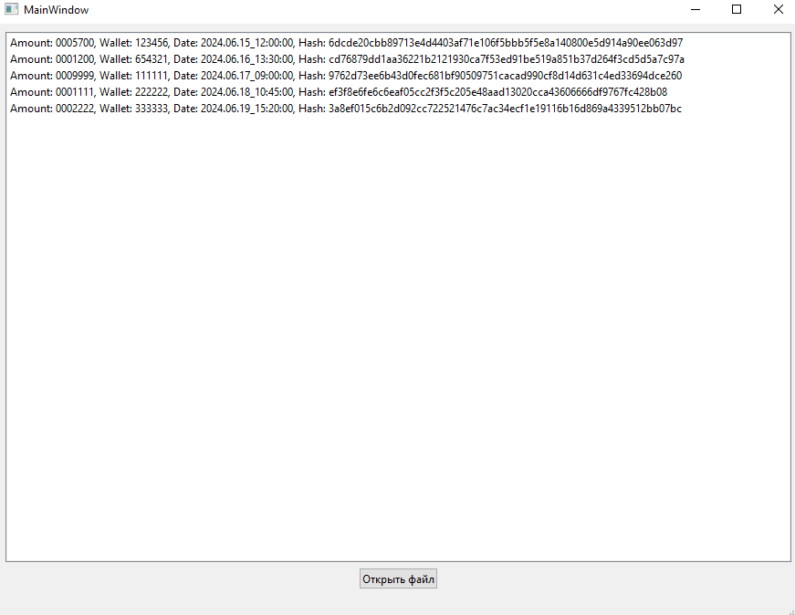

# Приложение для проверки транзакций пользователей

## Описание

Данное приложение предназначено для загрузки и проверки транзакций из файла формата JSON. 
Программа вычисляет хеш каждой транзакции и сравнивает его с заданным хешем, чтобы проверить целостность данных. 
Если хеши не совпадают или формат данных транзакции некорректен, такие транзакции выделяются красным цветом.

## Функционал

- Загрузка транзакций из JSON файла.
- Проверка корректности формата данных транзакций (длина полей amount, wallet и date).
- Вычисление и проверка хеша SHA-256 для каждой транзакции.
- Выделение некорректных транзакций красным цветом.
- Возможность загрузки другого файла транзакций через интерфейс.

## Интерфейс

### Главный экран

### Открытие файла транзакций

